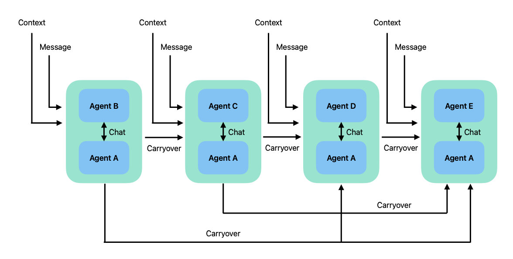

summary: Autogen, Assemble! - Codemotion Conference Milan 2024
id: autogen-assemble
status: Published
authors: xtream

## 👋 Introduction

The aim of this document is to provide a guide to the different iterations we will go through using **Autogen Studio**.
Attendees to the live workshop can use this file to follow along with the presentation.

The workshop is divided into several checkpoints, each representing a significant step in our journey. The final stage
of each checkpoint is available in a dedicated branch, which you can check out if you want to skip the steps to
reproduce or if you fall behind.

> This document also routes to different assets like system prompts and configuration that will be used.

## Let's have a look at the app

Go to [the app](http://localhost:3001) to see the app in action. The app is a LinkedIn post generator that
uses the gpt-4o model to generate posts based on a given prompt. The app is simple and straightforward, but we can
enhance it by using Autogen Studio.

## Let's go through AutoGen Studio

Go to [AutoGen Studio](http://localhost:8081) and see its user interface. This is where we will
configure our agents and workflows to enhance the app.

> Notice how we already set up models for convenience, using the API in the `.env` file. You can always add new ones.

## Recreating the one-shot prompt case in Studio

We will start by reproducing the one-shot prompt generation of the sample app using Autogen Studio. To do this, we will
configure a **sequential workflow** that includes only one copywriter agent, whose task is to generate text in response
to our requests. This simple workflow allows us to exactly replicate the behavior of the sample app and serves as a
starting point.


### 💬 What is a Sequential Chat?

The "Sequential Chat" is a type of linear workflow where agents operate one after another. In this case, we will use
only one agent, but the workflow structure would allow us to add other steps and build more complex flows.


### 💡 What is the output of a sequential chat?

The summary method in AutoGen is a fundamental feature that determines how interactions between agents are summarized as
output at the end of a workflow. Examples of built-in summary methods are:

- **last message**: summarizes the last message exchanged, providing immediate context;
- **llm summarization**: uses a language model to generate a more comprehensive and contextualized summary.

> Beware that the summarization describes the conversation, so it might be hard to use for a precise output

### ⚙️ Let's configure it!

> **Checkpoint ⭐**: checkout branch `checkpoints/checkpoint-1` to skip the next steps and get the system pre-configured.
> Reload the AutoGen Studio
> container with this command:
> ```bash
> docker-compose restart autogenstudio-ui
> ```

To create this simple workflow in Studio, follow these steps:

1. **Create a user proxy agent**:
2. **Create a copywriter assistant agent**:
    - Set the temperature to 0.5 as in the sample app - we want a fairly creative copywriter;
    - Connect one of the existing models, already loaded during setup;
    - Set its system prompt to [copywriter.v1](assets/prompts/copywriter.v1.txt) in the asset folder - but feel free to
      inspect and edit.
3. **Create a sequential workflow**:
    - Add the copywriter as the only step;
    - Set the summarization to `last`;

👉 By running this workflow, you will obtain results similar to those of the sample application.

## Adding a critic to the mix

To try and get a higher quality copy, we will add an **adversarial agent** that will comment on the copywriter's work,
allowing the model to iterate and reflect on possible improvements. We will create a critic agent, informed about the
same guidelines the copywriter is following, but specialised in spotting where the style of writing is suboptimal.

### 💬 Conversation Layout

We don't know what the critic will say, nor we want to make assumptions about whether any fix will be necessary, or how
many iterations will be needed to converge. Therefore, a sequential chat is no longer suited for the task. Instead, we
will exploit AutoGen most flexible tool: **group chats**. The group chat is a collection of agents collaborating
together, speaking at turns, sharing a single discussion thread.

#### 👇 AutoGen group chat pattern


#### 👇 The team we want to setup


### 🤔 Who speaks next?

One key element of a group chat is deciding who speaks next: The **group chat manager** is responsible for deciding.
It can do so autonomously using an LLM, going in Round Robin or Random order. When an agent sends a message, the manager
distributes it to all other agents via broadcasting so that everyone is on the same page.

> The group chat manager does not instruct the agents directly, it just decides who's next and hands them the speaker
> spot to continue on the task, but never says a word in the shared conversation. Some developers would say this is the
> best type of management.

### ⚙️ Let's configure it!

> **Checkpoint ⭐**: checkout branch `checkpoints/checkpoint-2` to skip the next steps and get the system pre-configured.
> Reload the AutoGen Studio container with this command:
> ```bash
> docker-compose restart autogenstudio-ui
> ```

To configure the workflow with a critic in Studio, follow these steps:

1. **Create the new style critic assistant agent**:
    - Assign a different model than the `copywriter` to ensure a diversity of feedback;
    - Set the temperature to 0 to grant the feedbacks consistency;
    - Set its system prompt to [style-critic](assets/prompts/style-critic.txt) in the asset folder - but feel free to
      inspect and edit.

2. **Create a `group_chat` type agent**:
    - Add the two agents (copywriter and critic);
    - Pick a LLM for the group chat manager, and set its temperature to 0;
    - Next speaker can be round-robin - we want them to discuss and converging over a final draft;
    - Prevent agents to speak twice in a row.
    - Max the number of rounds to 10.

3. **Update copywriter system prompt**
    - Set the copywriter system prompt to [copywriter.v2](assets/prompts/copywriter.v2.txt) in the asset folder - but
      feel free to inspect and edit.

4. **Create an autonomous workflow**:
    - Set the user_proxy as initiator and the group as receiver;
    - Let's keep the summarization as `last`.

👉 By running this workflow, we can observe how the critic's intervention improves the quality of the generated text,
providing constructive suggestions and stimulating a more effective iterative process.

## Introducing a publisher

The summary method is effective, but if we need a specific output from the workflow, the autonomous chat is not able to
guarantee it. To overcome this problem, we introduce a new agent called **publisher**, whose sole task will be to "
publish" the copy once it's ready. For our use case, publishing means:

- returning the final copy,
- terminating the workflow, by emitting a TERMINATE message.
  to stop.


### ⚙️ Let's configure it!

> **Checkpoint ⭐**: checkout branch `checkpoints/checkpoint-3` to skip the next steps and get the system pre-configured.
> Reload the AutoGen Studio container with this command:
> ```bash
> docker-compose restart autogenstudio-ui
> ```

To update the workflow in Studio, follow these steps:

1. **Create a new publisher assistant agent**:
    - Set the temperature to 0 to ensure consistency;
    - Connect one of the existing models, such as `gpt-4o`.
    - Set its system prompt to [publisher](assets/prompts/publisher.txt) in the asset folder - but feel free to inspect
      and edit.

2. **Update the Group Chat**:
    - Add the publisher to the existing group chat;
    - Set the next speaker selection to **auto** to allow a self-managed flow between agents;

3. **Improve agent descriptions**:

   Provide more detailed descriptions for each agent so that the grouo chat manager can better understand their role,
   and be more precise in deciding who's next to speak:

   | Agent | Description |
            | ------------ | -------------------------------------------------------------------------------- |
   | copywriter | writes the actual content drafts, once the topics are understood |
   | style_critic | challenges copy drafts about their style |
   | publisher | talks after every critic say it's ok on their side, stays silent until then |

4. **No change needed on the workflow**:
   The workflow is already configured to offload the task to the group chat, so no change is required.

👉 Let's run and see if we get a nicely published copy!

## 💡What if we're writing about an unknown topic?

In some cases, it may be necessary to generate content on unknown topics. To address this challenge, it's important that
the system is able to "study" the topic before continuing. This "study" cannot be internal reflection, as it would not
augment the LLM knowledge. Instead, we need to do what we would do: online research.

Anytime we need some external tool ro capability, we can define a **skill** in Studio, and give that skill to an agent.

### 💡What is a skill?

Skills are custom functionalities, defined as Python functions, that an agent can use to complete a specific task. In
this case, we will define a skill to answer questions regarding the topic we need to write about. The skill will use
Perplexity API, leveraging its capability to return concise answers grounded in online sources.

### 💡 Who executes the code?

Code execution is of the features that make AutoGen so extensible. Agents can be configured to allow for code execution,
in the local environment. The agent will execute the code and share its output with the other agents in the chat.

### 💬 Conversation Layout


### ❓ Why do we need a team of two agents to run the skill?

One agent can both writer and executor. However, those two actions cannot happen within a single response, since the
code to run is the output of the first step, which needs to be fed to the executor agent. Therefore, to keep
responsibilities well decoupled and get a more stable group chat, we opted for a two-agent job.

### ⚙️ Let's configure it!

> **Checkpoint ⭐**: checkout branch `checkpoints/checkpoint-4` to skip the next steps and get the system pre-configured.
> Reload the AutoGen Studio container with this command:
> ```bash
> docker-compose restart autogenstudio-ui
> ```

To configure this workflow:

1. **Create a new content critic assistant agent**:
    - Set the temperature to 0 to ensure consistency;
    - Connect one of the existing models, such as `gpt-4o`;
    - Set its system prompt to [content-critic](assets/prompts/content-critic.txt) in the asset folder - but feel free
      to inspect and edit.

2. **Create a new code executor (user proxy) agent**:
    - Set the temperature to 0 to ensure consistency;
    - Connect one of the existing models, such as `gpt-4o`;
    - Enable code execution in the settings;
    - No need for a system prompt.

3. **Create a new software developer assistant agent**:
    - Set the temperature to 0 to ensure consistency;
    - Connect one of the existing models, such as `gpt-4o`;
    - Set its system prompt to [sw-developer](assets/prompts/sw-developer.txt) in the asset folder - but feel free to
      inspect and edit.

4. **Create a new skill and grant it to the developer**:
    - Add Python code from [skill.py](assets/skill.py) in the asset folder;
    - Set `PERPLEXITY_API_KEY` to the provided key;
    - Link the newly created skill to the software developer agent.

5. **Update the Group Chat**:
    - Add the 3 new agents to the chat
    - Increase the maximum number of rounds to 30;

6. **Improve agent descriptions**:
   Again, let's revise descriptions to help out the group chat manager figuring out who's best to speak next:

   | Agent | Description |
   | ------------ | -------------------------------------------------------------------------------- |
   | copywriter | writes the actual content drafts, once the topics are understood |
   | style critic | challenges copy drafts about their style |
   | publisher | talks after every critic say it's ok on their side, stays silent until then |
   | content critic | challenges copy drafts about the things they contain |
   | sw developer | talks when mentioned in the chat or there's code to generate/fix/run |
   | code executor | intervenes WHENEVER there's a code snippet to execute |

7. **No change needed on the workflow**:
   The workflow is already configured to offload the task to the group chat, so no change is required.

👉 Let's run and see if we get a nicely published copy!

## Let's use our multi-agent system in our app

AutoGen Studio allows to export the workflow as a JSON file. This workflow can then be served by AutoGen Server, which
provides an HTTP API to interact with the workflow. The API can be used to start a new session, send messages to the
workflow, and retrieve the conversation history.

### ⚙️ Let's configure it!

> **Checkpoint ⭐**: checkout branch `checkpoints/checkpoint-5` to skip the next steps and get the system pre-configured.

1. Export the workflow from Studio, downloading it as a file;
2. Put the downloaded file in the `workflows` folder of `../autogen`;
3. Update the docker-compose service autogenstudio-server command with the correct workflow file
   name `--workflow /workflows/<workflow_example>.json`
4. Run the AutoGen Server:
   ```bash
   docker-compose up -d autogenstudio-server
   ```
   AutoGen is now exposing a REST API on `http://localhost:8082`. You can check the API swagger
   at `http://localhost:8082/docs`. The API offers a `GET /predict/{input}` endpoint to which
   we can send messages and get responses.
5. Update the [api](../linkedin-post-generator/src/pages/api/linkedin-post.ts) file in the app to point to the new
   server;

### Let's test it!
> These steps are mandatory even if you skipped the previous ones and checked out the `checkpoint-5` branch.
1. Start the AutoGen Server (if not running already)
    ```bash
    docker-compose up -d autogenstudio-server
    ```
2. Rebuild the app
    ```bash
    npm run web-app:build
    ```
3. Restart the app container
    ```bash
    docker-compose restart linkedin-app
    ```